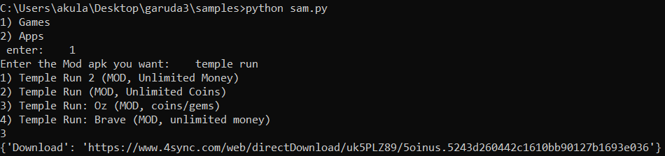

# CLI python program for mod apks
## WHAT WILL WE GET:-
    We can access various mod,paid,premium apk links of any app you want.
    run it by:- python main.py
    Modules required:- Requests,Bs4.
## HERE IS THE EXAMPLE:-

